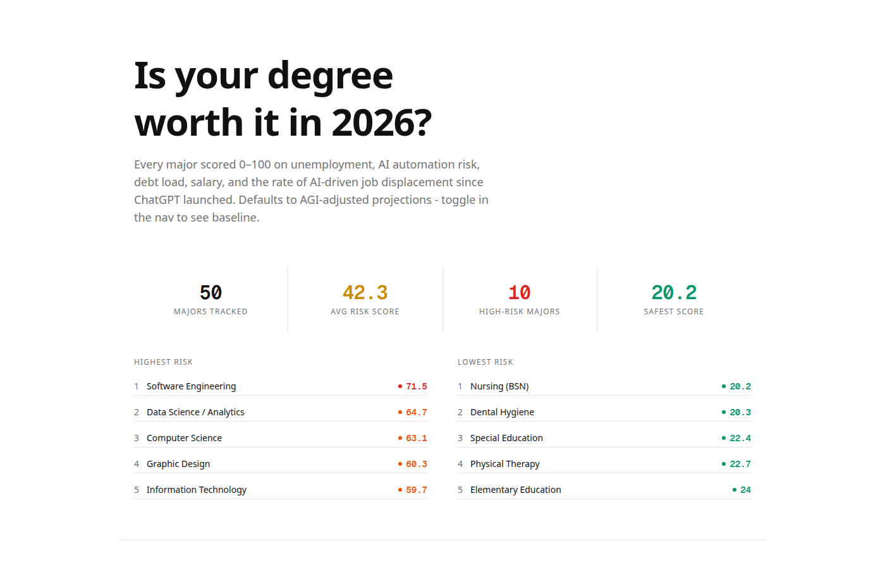

# f(x) university



> `are we screwed?` `we're cooked bro` `my CS degree is a receipt` `$45k for what exactly` `nursing kids stay winning` `AI took my job before I got it` `should've been a plumber` `71.5 risk score lmao`

the tool universities don't want you to see. every college major scored 0-100 based on real data - unemployment, AI automation risk, debt, salary, and the rate things have gotten worse since ChatGPT dropped.

starts in AGI mode because that's where we're headed. toggle it off if you want the copium version.

## run it

```bash
docker compose up
```

- frontend: http://localhost:3000
- backend api: http://localhost:8000
- postgres: localhost:5432

## stack

- **frontend** - next.js, react, tailwind, recharts
- **backend** - python, fastapi, sqlalchemy
- **db** - postgresql
- **infra** - docker compose

## what's in it

- **50 majors ranked** by risk score with sortable table
- **AI acceleration factor** - measures how fast unemployment is rising since ChatGPT (nov 2022), not just a snapshot
- **trend chart** - CS/tech unemployment 2019-2030 with AGI scenario projection
- **AGI mode** - toggle 1.5x-5x multiplier on all AI factors, with quotes from the people building it
- **personal calculator** - plug in your own numbers
- **debt clock** - watch your interest accumulate in real time
- **sources on every data point** - click any row, it's all cited
- **methodology page** - full formula breakdown, all sources listed

## the formula

```
score = (
  0.20 x unemployment +
  0.25 x automation_risk +
  0.35 x debt_salary_ratio +
  0.20 x acceleration
) x 100
```

acceleration = how much unemployment increased since pre-ChatGPT. software engineering went from 2.5% to 7.5% = 3x. nursing went from 1.6% to 1.9% = barely moved. that's the signal.

## data

edit `backend/data/majors.json` or write directly to postgres. the scoring formula lives in `backend/scoring.py` - weights are at the top, change them and everything recalculates.

## sources

BLS, NY Fed, Oxford/Frey-Osborne, College Scorecard, NACE, McKinsey, Goldman Sachs, Indeed Hiring Lab. full list on the [methodology page](http://localhost:3000/methodology).

## contributing

find bad data? better sources? open a PR. the whole point is making this undeniable.
